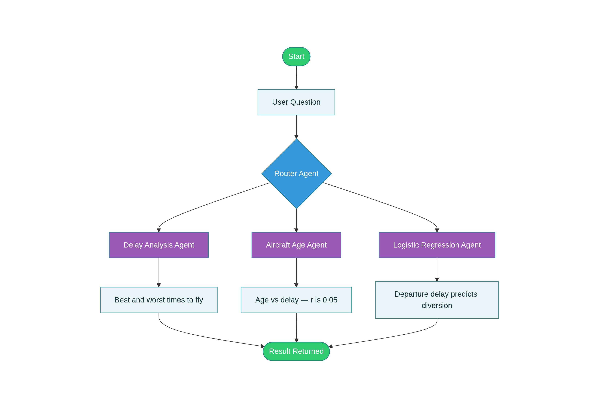

# Flight Delay & Diversion Analysis - LangGraph Agentic Workflow

A multi-agent AI pipeline built with **LangGraph** that analyses US domestic flight patterns using a conditional routing architecture.

## How It Works



A central **Router Agent** receives a natural language question and intelligently directs it to the correct specialist agent:

Agent Task Methods Used:
1. Delay Analysis Agent: Best/worst times to fly (Pandas groupby, mean aggregation)
2. Aircraft Age Agent: Does plane age affect delays? (Pearson correlation, linear regression)
3. Logistic Regression Agent: What predicts flight diversion? (Sklearn logistic regression)

Each agent runs **live computation** on a 50,000-row synthetic dataset modelled on 2005–2007 US flight patterns, then validates findings against the original report results.

## Key Findings (Validated against 2005-2007 US Flight Data)

**Best times to fly:**
- Hours: 6AM–11AM (lowest avg departure delay)
- Days: Tuesday and Wednesday
- Months: September and October

**Aircraft age:**
- Correlation r ≈ 0.05 - weak, not a meaningful predictor
- Operational factors (time of day, season) matter far more

**Diversion predictors (US Airways, logistic regression):**
- Departure delay is the strongest predictor
- Model findings consistent across 2005, 2006, 2007

## Tech Stack

- Python
- LangGraph (StateGraph, conditional routing)
- Pandas, NumPy, SciPy, Scikit-learn

## Run It

**Install dependencies:**
```bash
pip install -r requirements.txt
```

**Run the pipeline:**
```bash
python main.py
```

No dataset download needed — synthetic data is generated automatically on first run.

## Project Context

Built as an extension of ST2195 coursework (University of London, SIM) to demonstrate agentic AI workflow design on top of existing data science analysis.
